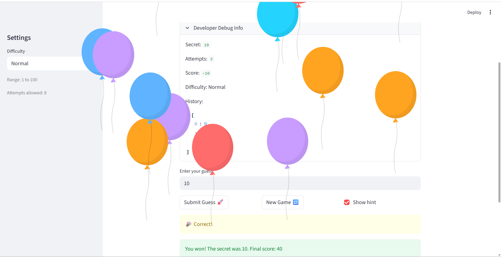
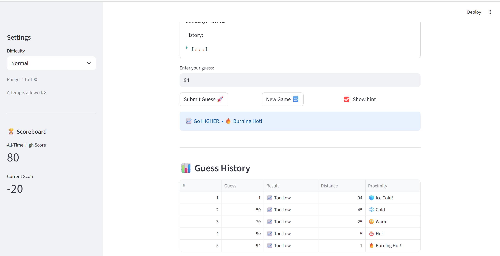

# 🎮 Game Glitch Investigator: The Impossible Guesser

## 🚨 The Situation

You asked an AI to build a simple "Number Guessing Game" using Streamlit.
It wrote the code, ran away, and now the game is unplayable.

- You can't win.
- The hints lie to you.
- The secret number seems to have commitment issues.

## 🛠️ Setup

1. Install dependencies: `pip install -r requirements.txt`
2. Run the fixed app: `python -m streamlit run app.py`

## 🕵️‍♂️ Your Mission

1. **Play the game.** Open the "Developer Debug Info" tab in the app to see the secret number. Try to win.
2. **Find the State Bug.** Why does the secret number change every time you click "Submit"? Ask ChatGPT: *"How do I keep a variable from resetting in Streamlit when I click a button?"*
3. **Fix the Logic.** The hints ("Higher/Lower") are wrong. Fix them.
4. **Refactor & Test.** - Move the logic into `logic_utils.py`.
   - Run `pytest` in your terminal.
   - Keep fixing until all tests pass!

## 📝 Document Your Experience

- [x] **Game purpose:** A number-guessing game where the player tries to identify a hidden number within a limited number of attempts. The difficulty setting controls the range (Easy: 1-20, Normal: 1-100, Hard: 1-200) and the attempt limit.

- [x] **Bugs found:**
  1. **Inverted hints** -"Go HIGHER!" displayed when guess was too high (should be "Go LOWER!"), and vice versa.
  2. **Secret converted to string on even attempts** -`str(st.session_state.secret)` on even-numbered guesses broke numeric comparison and produced wrong hints silently.
  3. **New Game didn't reset game state** -clicking New Game after winning/losing never reset `status`, `history`, or `score`, so the game remained locked.
  4. **Hard difficulty was easier than Normal** - range was 1-50 instead of something harder like 1-200.
  5. **Wrong guesses rewarded points on even attempts** -`update_score` added +5 for a "Too High" guess on even attempt numbers.
  6. **Attempt counter started at 1** -the first real guess was counted as the second attempt.

- [x] **Fixes applied:**
  - Swapped the hint messages in `check_guess` so "Too High" → "Go LOWER!" and "Too Low" → "Go HIGHER!".
  - Removed the `str()` cast; always pass the integer secret to `check_guess`.
  - New Game now resets `status`, `history`, and `score` in addition to `attempts` and `secret`.
  - Changed Hard difficulty range to `(1, 200)`.
  - `update_score` now always subtracts 5 for any wrong guess, regardless of attempt parity.
  - Initialised `attempts` to `0` instead of `1`.
  - Moved all four logic functions into `logic_utils.py` and imported them in `app.py`.

## 📸 Demo

## 🚀 Stretch Features

### Challenge 1 - Advanced Edge-Case Testing
Added 19 new pytest cases in `tests/test_game_logic.py` covering:
- **Negative numbers** (`"-5"` parses to `-5`; a negative guess returns "Too Low")
- **Decimal truncation** (`"7.9"` → `7`, not `8`) and negative decimals (`"-3.7"` → `-3`)
- **Extremely large values** (`"999999999999"` parses without error)
- **Whitespace-only input** (correctly rejected as invalid)
- **Boundary guesses** (exactly one above / one below the secret)
- **Score floor** (winning on attempt 20 still awards the minimum 10 points)
- **Zero range / zero distance** edge cases in `get_hot_cold_label`

All 26 tests pass: `pytest tests/test_game_logic.py -v`.

### Challenge 2 - High Score Tracker
Created `high_score.py` with `load_high_score()` and `save_high_score()`.
- Scores are persisted to `highscore.json` next to the module.
- The sidebar shows **All-Time High Score** and **Current Score** metrics.
- When a player wins and beats the record, the app announces it with a trophy banner.
- All I/O errors are silently swallowed so a corrupt file never crashes the game.

### Challenge 3 - Professional Documentation and PEP 8
Rewrote every function in `logic_utils.py` with Google-style docstrings including
`Args`, `Returns`, and `Examples` sections.  Added the new `get_hot_cold_label`
helper with full documentation.  PEP 8 compliance verified (line lengths, spacing,
blank lines between top-level definitions).

### Challenge 4 - Enhanced Game UI
- **Color-coded hints**: wrong guesses use `st.error` (red) for "Too High" and
  `st.info` (blue) for "Too Low" instead of the neutral `st.warning`.
- **Hot/Cold proximity label**: every hint now appends one of
  🔥 Burning Hot! / ♨️ Hot / 😐 Warm / ❄️ Cold / 🧊 Ice Cold!
  based on how close the guess was to the secret (scaled to the difficulty range).
- **Session history table**: a `📊 Guess History` section appears after the first
  guess showing attempt number, guess value, direction result, distance, and
  the hot/cold label for every valid guess in the current game.

### Challenge 5 - AI Model Comparison
See the bottom of `reflection.md` for a head-to-head comparison of
Claude Sonnet 4.6 vs. ChatGPT GPT-5.2 on the inverted-hints bug fix.
